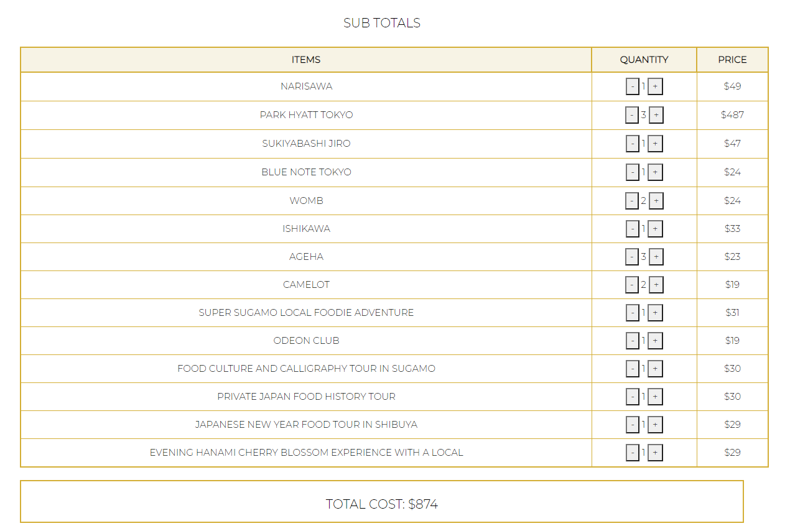

# Budget Bucket :page_with_curl:

## Table of Contents :file_folder:
- [Description](#description)
- [Tests](#tests)
- [Technology](#technology)
- [Contributors](#contributors)
- [Contact](#contact)

## Description :book:
  You've wanted to travel since the dawn of COVID, and in the uncertain times comes uncertain budgets. We're here to help. Simply give us an idea of what your goals are for your travel arrangements and we'll help you plan the dream trip with your specific budget in mind! Come journey with us to the pristine shores of Destin, FL. Come frolic with us in the gorgeous plains of south Arkansas.

## Tests :bar_chart:
Simply follow the link to our deployed app (kudos to Heroku) and experience the magic!

### :calendar: https://bucketbudgetplanner.herokuapp.com/ :airplane:

## Technology :computer:
Preparation & Execution: Figma (wireframing), Discord, Slack & Zoom (coordination).  
Frontend: HTML, CSS & bootstrap components; JavaScript & jQuery.  
Backend: Node.js, Express, mySQL, Sequelize, Heroku, & GitHub.  

## Contributors :milky_way:

Get to know our engineers & keep up with their latest updates via GitHub:

 
Nick Burt - Virtuoso Backend & Full-Flex Engineer

 
Shubhangi Mundhada - Prodigy Frontend UI/UX Architect

 
Bradley Guidry - Project Innovator, Manager & Team Lead

 
Cooper Ahearn - HR & Public Affairs; Auxiliary Support

## Contact :email:

Connect with & contact the engineers directly via LinkedIn:

:dvd: Nick - <a href="https://www.linkedin.com/in/nick-burt/">nick-burt</a> :dvd:  
:cd: Shubhangi - <a href="https://www.linkedin.com/in/shubhi-mundhada/">shubhi-mundhada</a> :cd:  
:dvd: Bradley - <a href="https://www.linkedin.com/in/bradley-guidry-076298187/">bradley-guidry</a> :dvd: 
:cd: Cooper - <a href="https://www.linkedin.com/in/lcahearn/">LCAhearn</a> :cd: 